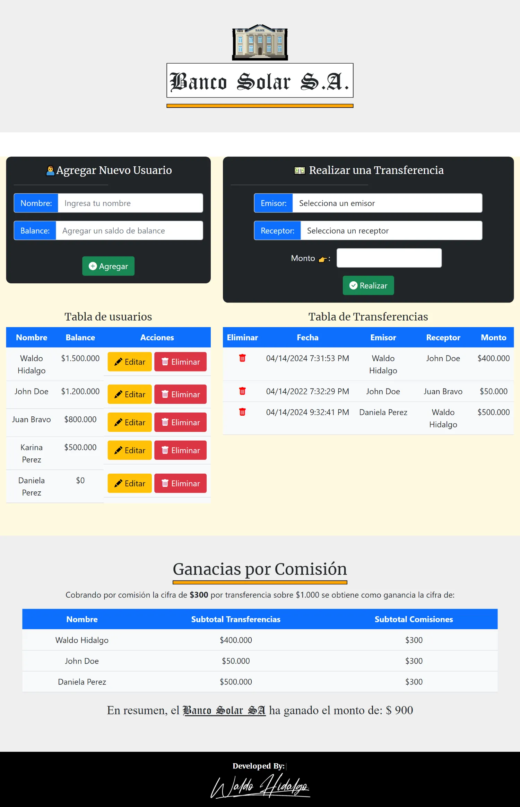

# Solución a la Prueba Banco Solar

Repositorio con el código solución a la prueba **Banco Solar** con la que se finaliza el módulo 7: **Acceso a datos en aplicaciones Node** de la beca otorgada por Talento Digital para Chile **Desarrollo de aplicaciones Full Stack Javascript Trainee** dictada por Desafío Latam.

He ido muchísimo más allá de los requerimientos del proyecto con la intención de autodesafiarme en implementar ideas que considero interesantes para complementar el proyecto. He modificado **por completo el front end** que se nos ha entregado al inicio, con la intención de personalizarlo en un 100% y extenderlo, tal y como lo he hecho, llegando al punto de ser el front end un "espejo" del back end y lograr manipular sin problemas varias rutas (9 queries a la base de datos y 9 fetch a rutas que manejan dichas queries).

## Tabla de Contenidos

- [Solución a la Prueba Banco Solar](#solución-a-la-prueba-banco-solar)
  - [Tabla de Contenidos](#tabla-de-contenidos)
  - [Requisitos](#requisitos)
  - [Librerias Utilizadas](#librerias-utilizadas)
  - [Deploy](#deploy)
  - [Proyecto Final 100% Responsivo](#proyecto-final-100-responsivo)
    - [Proyecto Final Big Devices](#proyecto-final-big-devices)
    - [Proyecto Final Small Devices](#proyecto-final-small-devices)
  - [Diagrama de Flujo](#diagrama-de-flujo)
    - [1. Creación de Usuario](#1-creación-de-usuario)
      - [1.1. Alerta de creación de Usuario ya registrado](#11-alerta-de-creación-de-usuario-ya-registrado)
      - [1.2. Alerta creación de Usuario exitosa](#12-alerta-creación-de-usuario-exitosa)
      - [1.3 Creación de usuario exitosa en el front end](#13-creación-de-usuario-exitosa-en-el-front-end)
      - [1.4. Creación de usuario exitosa en el back end](#14-creación-de-usuario-exitosa-en-el-back-end)
    - [2. Edición de Usuario](#2-edición-de-usuario)
      - [2.1. UI Edición de Usuario](#21-ui-edición-de-usuario)
      - [2.2. Alerta Edición exitosa de usuario](#22-alerta-edición-exitosa-de-usuario)
      - [2.3. Edición Exitosa en el front end](#23-edición-exitosa-en-el-front-end)
      - [2.4. Edición Exitosa en el back end](#24-edición-exitosa-en-el-back-end)
    - [3. Transferencia](#3-transferencia)
      - [3.1. Alerta transferencia entre mismos usuarios](#31-alerta-transferencia-entre-mismos-usuarios)
      - [3.2. Error transferencia con saldos insuficientes](#32-error-transferencia-con-saldos-insuficientes)
      - [3.3. Alerta de Transferencia exitosa](#33-alerta-de-transferencia-exitosa)
      - [3.4. Transferencia exitosa en el front end](#34-transferencia-exitosa-en-el-front-end)
      - [3.5. Transferencia exitosa en el back end](#35-transferencia-exitosa-en-el-back-end)
    - [4. Eliminación de Usuario](#4-eliminación-de-usuario)
      - [4.1. Alerta de imposibilidad de eliminación de usuario con transferencias hechas](#41-alerta-de-imposibilidad-de-eliminación-de-usuario-con-transferencias-hechas)
      - [4.2. Alerta eliminación exitosa de transferencias con clave foranea al usuario que se desea eliminar](#42-alerta-eliminación-exitosa-de-transferencias-con-clave-foranea-al-usuario-que-se-desea-eliminar)
      - [4.3. Transferencia eliminada con éxito en el front end](#43-transferencia-eliminada-con-éxito-en-el-front-end)
      - [4.4. Transferencia eliminada con éxito en el back end](#44-transferencia-eliminada-con-éxito-en-el-back-end)
      - [4.5. Alerta eliminación usuario exitosa](#45-alerta-eliminación-usuario-exitosa)
      - [4.6. Eliminación de usuario exitosa en el front end](#46-eliminación-de-usuario-exitosa-en-el-front-end)
      - [4.7. Eliminación de usuario exitosa en el back end](#47-eliminación-de-usuario-exitosa-en-el-back-end)
  - [Soluciones](#soluciones)
    - [1.Utilizar el paquete pg para conectarse a PostgreSQL y realizar consultas DML para la gestión y persistencia de datos. (3 Puntos)](#1utilizar-el-paquete-pg-para-conectarse-a-postgresql-y-realizar-consultas-dml-para-la-gestión-y-persistencia-de-datos-3-puntos)
    - [2.Usar transacciones SQL para realizar el registro de las transferencias. (2 Puntos)](#2usar-transacciones-sql-para-realizar-el-registro-de-las-transferencias-2-puntos)
    - [3.Servir una API RESTful en el servidor con los datos de los usuarios almacenados en PostgreSQL. (3 Puntos)](#3servir-una-api-restful-en-el-servidor-con-los-datos-de-los-usuarios-almacenados-en-postgresql-3-puntos)
    - [4.Capturar los posibles errores que puedan ocurrir a través de bloques catch o parámetros de funciones callbacks para condicionar las funciones del servidor. (1 Punto)](#4capturar-los-posibles-errores-que-puedan-ocurrir-a-través-de-bloques-catch-o-parámetros-de-funciones-callbacks-para-condicionar-las-funciones-del-servidor-1-punto)
    - [5.Devolver correctamente los códigos de estado según las diferentes situaciones. (1 Punto)](#5devolver-correctamente-los-códigos-de-estado-según-las-diferentes-situaciones-1-punto)
  - [¡Extra!](#extra)

## Requisitos


## Librerias Utilizadas

| Tecnologías Utilizadas |
| ---------------------- |
| JQuery                 |
| Bootstrap              |
| SCSS                   |
| Axios                  |
| Moment                 |
| Bootstrap-icons        |
| Express                |
| pg                     |
| Typewriter-effect      |
| Sweetalert2            |

## Deploy

Mi proyecto es completamente funcional y lo he desplegado en Render.com en la siguiente URL: [Banco Solar de Waldo Hidalgo](https://banco-solar.onrender.com/)

## Proyecto Final 100% Responsivo

### Proyecto Final Big Devices


### Proyecto Final Small Devices

En pantallas small, las tablas permiten ser visualizadas por completo ya que el overflow presenta scrollbars:


## Diagrama de Flujo

### 1. Creación de Usuario

#### 1.1. Alerta de creación de Usuario ya registrado

Se impide la creación de usuarios con mismo nombre:


#### 1.2. Alerta creación de Usuario exitosa

Se procede a crear un usuario de nombre **Daniela Perez** con saldo igual a **500000**:


#### 1.3 Creación de usuario exitosa en el front end


#### 1.4. Creación de usuario exitosa en el back end


### 2. Edición de Usuario

#### 2.1. UI Edición de Usuario


#### 2.2. Alerta Edición exitosa de usuario


#### 2.3. Edición Exitosa en el front end


#### 2.4. Edición Exitosa en el back end


### 3. Transferencia

#### 3.1. Alerta transferencia entre mismos usuarios


#### 3.2. Error transferencia con saldos insuficientes


#### 3.3. Alerta de Transferencia exitosa

Se procede a realizar una transferencia desde el usuario **Daniela Perez** al usuario **Waldo Hidalgo** por el monto de **500000**:


#### 3.4. Transferencia exitosa en el front end



#### 3.5. Transferencia exitosa en el back end


### 4. Eliminación de Usuario

Deseo eliminar el usuario **Daniela Perez**, sin embargo, el usuario presenta transferencias hechas por lo cual se procede a eliminar transferencias realizadas por el usuario y hacia el usuario para posteriormente eliminar al usuario:

#### 4.1. Alerta de imposibilidad de eliminación de usuario con transferencias hechas

Si se desea eliminar un usuario con transferencias hechas se genera un error de violación de la integridad referencial ya que la tabla de hechos presenta claves foraneas con la tabla de dimensiones:


#### 4.2. Alerta eliminación exitosa de transferencias con clave foranea al usuario que se desea eliminar


#### 4.3. Transferencia eliminada con éxito en el front end


#### 4.4. Transferencia eliminada con éxito en el back end


Una vez eliminadas todas las transferencias asociadas al usuario **Daniela Perez** es posible eliminar a dicho usuario con éxito:

#### 4.5. Alerta eliminación usuario exitosa


#### 4.6. Eliminación de usuario exitosa en el front end


#### 4.7. Eliminación de usuario exitosa en el back end


## Soluciones

### 1.Utilizar el paquete pg para conectarse a PostgreSQL y realizar consultas DML para la gestión y persistencia de datos. (3 Puntos)

Se ha utilizado el paquete **pg** para realizar 9 queries a la base de datos:

```js
import pool from "../config/db.js";

export async function getUsersQuery() {
  try {
    const response = await pool.query("SELECT * FROM bancosolar_usuarios");

    return response.rows;
  } catch (error) {
    return error;
  }
}

export async function addUserQuery(data) {
  try {
    const response = await pool.query(
      "INSERT INTO bancosolar_usuarios  (nombre, balance) VALUES ($1, $2) RETURNING *",
      data,
    );
    if (response.rowCount === 0) {
      throw new Error("No se pudo agregar el usuario");
    }
    return response.rows[0];
  } catch (error) {
    return error;
  }
}

export async function deleteUserQuery(id) {
  try {
    const response = await pool.query(
      "DELETE FROM bancosolar_usuarios  WHERE id = $1 RETURNING *",
      [id],
    );
    if (response.rowCount === 0) {
      throw new Error("No se pudo eliminar el usuario");
    }
    return response.rows[0];
  } catch (error) {
    return error;
  }
}

export async function editUserQuery(data) {
  try {
    const response = await pool.query(
      "UPDATE bancosolar_usuarios SET nombre = $2, balance = $3 WHERE id = $1 RETURNING *",
      data,
    );
    if (response.rowCount === 0) {
      throw new Error("No se pudo editar el usuario");
    }
    return response.rows[0];
  } catch (error) {
    return error;
  }
}

export async function getTransferenciasQuery() {
  try {
    const response = await pool.query(
      "SELECT * FROM bancosolar_transferencias",
    );

    return response.rows;
  } catch (error) {
    return error;
  }
}

export async function postAddTransferenciaQuery(data) {
  const client = await pool.connect();

  try {
    const { emisor, receptor, monto, fecha } = data;
    await client.query("BEGIN");
    const queryTransferenciaEmisor = {
      text: "update bancosolar_usuarios  set balance = balance - $2 where id = $1 returning *",
      values: [emisor, monto],
    };
    const responseEmisor = await client.query(queryTransferenciaEmisor);
    if (responseEmisor.rowCount === 0) {
      throw new Error("No se pudo realizar la transferencia");
    }

    const queryTransferenciaReceptor = {
      text: "update bancosolar_usuarios  set balance = balance + $2 where id = $1 returning *",
      values: [receptor, monto],
    };

    const responseReceptor = await client.query(queryTransferenciaReceptor);
    if (responseReceptor.rowCount === 0) {
      throw new Error("No se pudo realizar la transferencia");
    }
    const queryTransferencia = {
      text: "INSERT INTO bancosolar_transferencias (emisor, receptor, monto, fecha) VALUES ($1, $2, $3, $4) returning *",
      values: [emisor, receptor, monto, fecha],
    };
    const responseTransferencia = await client.query(queryTransferencia);
    if (responseTransferencia.rowCount === 0) {
      throw new Error("No se pudo realizar la transferencia");
    }

    await client.query("COMMIT");
  } catch (e) {
    console.log(e.message);
    await client.query("ROLLBACK");
    throw e;
  } finally {
    client.release();
  }
}

export async function deleteTransferenciaQuery(id) {
  try {
    const response = await pool.query(
      "DELETE FROM bancosolar_transferencias WHERE id = $1 RETURNING *",
      [id],
    );
    if (response.rowCount === 0) {
      throw new Error("No se pudo eliminar la transferencia");
    }
    return response.rows[0];
  } catch (error) {
    return error;
  }
}

export async function getComisionesQuery() {
  const comision = 300;
  try {
    const query = {
      text: `select j.id,j.nombre,sum(j.monto ) as subtotal_transferencias ,sum(j.subtotal_ganancias) as subtotal_comisiones
      from
      (select u.id,u.nombre,t.monto,
      case when t.monto<1000 then 0 else $1 end AS subtotal_ganancias 
      from bancosolar_transferencias t
      INNER JOIN 
      bancosolar_usuarios u ON t.emisor = u.id) j
        group by j.id,j.nombre;
  `,
      values: [comision],
    };
    const response = await pool.query(query);

    return response.rows;
  } catch (error) {
    return error;
  }
}

export async function resetDataQuery() {
  const client = await pool.connect();
  try {
    await client.query("BEGIN");

    await client.query("delete from bancosolar_transferencias");

    await client.query(
      "ALTER SEQUENCE bancosolar_transferencias_id_seq RESTART WITH 1",
    );

    await client.query("delete from bancosolar_usuarios");

    await client.query(
      "ALTER SEQUENCE bancosolar_usuarios_id_seq RESTART WITH 1",
    );

    await client.query(`insert into 
    bancosolar_usuarios(nombre,balance)
    values ('Waldo Hidalgo',1000000),
    ('John Doe',1200000),
    ('Juan Bravo',800000),
    ('Karina Perez',500000)`);

    await client.query(`insert into 
    bancosolar_transferencias 
    (emisor,receptor,monto,fecha)
    values
    (1,2,400000,'2024-04-14 19:31:53.000'),
    (2,3,50000,'2022-04-14 19:32:29.000')`);

    await client.query("COMMIT");
  } catch (e) {
    console.log(e.message);
    await client.query("ROLLBACK");
    throw e;
  } finally {
    client.release();
  }
}
```

### 2.Usar transacciones SQL para realizar el registro de las transferencias. (2 Puntos)

A continuación muestro el código que permite realizar transferencias en el cual utilizo transacciones SQL:

```js
export async function postAddTransferenciaQuery(data) {
  const client = await pool.connect();

  try {
    const { emisor, receptor, monto, fecha } = data;
    await client.query("BEGIN");
    const queryTransferenciaEmisor = {
      text: "update bancosolar_usuarios  set balance = balance - $2 where id = $1 returning *",
      values: [emisor, monto],
    };
    const responseEmisor = await client.query(queryTransferenciaEmisor);
    if (responseEmisor.rowCount === 0) {
      throw new Error("No se pudo realizar la transferencia");
    }

    const queryTransferenciaReceptor = {
      text: "update bancosolar_usuarios  set balance = balance + $2 where id = $1 returning *",
      values: [receptor, monto],
    };

    const responseReceptor = await client.query(queryTransferenciaReceptor);
    if (responseReceptor.rowCount === 0) {
      throw new Error("No se pudo realizar la transferencia");
    }
    const queryTransferencia = {
      text: "INSERT INTO bancosolar_transferencias (emisor, receptor, monto, fecha) VALUES ($1, $2, $3, $4) returning *",
      values: [emisor, receptor, monto, fecha],
    };
    const responseTransferencia = await client.query(queryTransferencia);
    if (responseTransferencia.rowCount === 0) {
      throw new Error("No se pudo realizar la transferencia");
    }

    await client.query("COMMIT");
  } catch (e) {
    console.log(e.message);
    await client.query("ROLLBACK");
    throw e;
  } finally {
    client.release();
  }
}
```

### 3.Servir una API RESTful en el servidor con los datos de los usuarios almacenados en PostgreSQL. (3 Puntos)

Se sirve la API REST en la siguiente ruta:

```js
router.get("/usuarios", getUsers);
```

la cual utiliza la función **getUsers** siguiente:

```js
export async function getUsers(req, res) {
  try {
    const users = await getUsersQuery();
    res.status(200).send(users);
  } catch (error) {
    res.status(500).send(error.message);
  }
}
```

La que a su vez utiliza la siguiente función **getUsersQuery**:

```js
export async function getUsersQuery() {
  try {
    const response = await pool.query("SELECT * FROM bancosolar_usuarios");

    return response.rows;
  } catch (error) {
    return error;
  }
}
```

A continuación muestro un screenshot de la API sirviendo con éxito:


### 4.Capturar los posibles errores que puedan ocurrir a través de bloques catch o parámetros de funciones callbacks para condicionar las funciones del servidor. (1 Punto)

A continuación muestro los 9 controllers manejando los errores mediante bloques **trycatch**:

```js
export async function getUsers(req, res) {
  try {
    const users = await getUsersQuery();
    res.status(200).send(users);
  } catch (error) {
    res.status(500).send(error.message);
  }
}

export async function addUser(req, res) {
  try {
    const data = req.body;

    const result = await addUserQuery([data.nombre, data.balance]);

    res.status(200).send(data);
  } catch (error) {
    res.status(500).send(error.message);
  }
}

export async function deleteUser(req, res) {
  try {
    const { id } = req.query;
    const result = await deleteUserQuery(id);
    res.status(200).send(result);
  } catch (error) {
    res.status(500).send(error.message);
  }
}

export async function editUser(req, res) {
  try {
    const { id } = req.query;
    const data = req.body;

    const result = await editUserQuery([id, data.nombre, data.balance]);
    res.status(200).send(result);
  } catch (error) {
    res.status(500).send(error.message);
  }
}

export async function getTransferencias(req, res) {
  try {
    const transferencias = await getTransferenciasQuery();
    res.status(200).send(transferencias);
  } catch (error) {
    res.status(500).send(error.message);
  }
}

export async function postAddTransferencia(req, res) {
  try {
    const data = req.body;
    const result = await postAddTransferenciaQuery(data);
    res.status(200).send(result);
  } catch (error) {
    res.status(500).send(error);
  }
}

export async function deleteTransferencia(req, res) {
  try {
    const { id } = req.query;
    const result = await deleteTransferenciaQuery(id);
    res.status(200).send(result);
  } catch (error) {
    res.status(500).send(error.message);
  }
}

export async function getComisiones(req, res) {
  try {
    const comisiones = await getComisionesQuery();

    res.status(200).json(comisiones);
  } catch (error) {
    res.status(500).send(error.message);
  }
}

export async function resetData(req, res) {
  try {
    await resetDataQuery();
    res.status(200).send("Data Reseteada");
  } catch (error) {
    res.status(500).send(error.message);
  }
}
```

### 5.Devolver correctamente los códigos de estado según las diferentes situaciones. (1 Punto)

Se han manejado todos los posibles errores y como ejemplo a continuación muestro el manejo del error **23503** el cual se origina cuando se desea eliminar un usuario con transferencias hechas (error generado por una FOREIGN KEY VIOLATION). Dicho error se maneja mostrando una alerta la cual he mostrado en la sección [4.1. Alerta de imposibilidad de eliminación de usuario con transferencias hechas](#41-alerta-de-imposibilidad-de-eliminación-de-usuario-con-transferencias-hechas):

```js
if (response.data.code === "23503") {
  Swal.fire({
    title: "Advertencia",
    text: "No se puede eliminar un usuario que tenga transferencias hechas",
    icon: "warning",
  });
  return;
}
```

## ¡Extra!

A los 30 minutos (1800000 milisegundos) se ejecuta el siguiente script que resetea la data en la base de datos eliminando **TODO** lo que se haya escrito. Además, se disponibiliza la ruta **reset** para resetear todo cada vez que se ingrese a dicha ruta:

```js
setInterval(async () => {
  try {
    const response = await fetch("https://banco-solar.onrender.com/reset", {
      method: "GET",
    });

    if (response.status === 200) {
      console.log("Se reinicio el servidor exitosamente");
      return;
    } else {
      throw new Error("No se pudo reiniciar el servidor");
    }
  } catch (error) {
    console.error("Error al llamar a la ruta:", error);
  }
}, 1800000);
```

La cual ejecuta la ruta que realiza la siguiente transacción en la base de datos:

```js
export async function resetDataQuery() {
  const client = await pool.connect();
  try {
    await client.query("BEGIN");

    await client.query("delete from bancosolar_transferencias");

    await client.query(
      "ALTER SEQUENCE bancosolar_transferencias_id_seq RESTART WITH 1",
    );

    await client.query("delete from bancosolar_usuarios");

    await client.query(
      "ALTER SEQUENCE bancosolar_usuarios_id_seq RESTART WITH 1",
    );

    await client.query(`insert into 
    bancosolar_usuarios(nombre,balance)
    values ('Waldo Hidalgo',1000000),
    ('John Doe',1200000),
    ('Juan Bravo',800000),
    ('Karina Perez',500000)`);

    await client.query(`insert into 
    bancosolar_transferencias 
    (emisor,receptor,monto,fecha)
    values
    (1,2,400000,'2024-04-14 19:31:53.000'),
    (2,3,50000,'2022-04-14 19:32:29.000')`);

    await client.query("COMMIT");
  } catch (e) {
    console.log(e.message);
    await client.query("ROLLBACK");
    throw e;
  } finally {
    client.release();
  }
}
```
